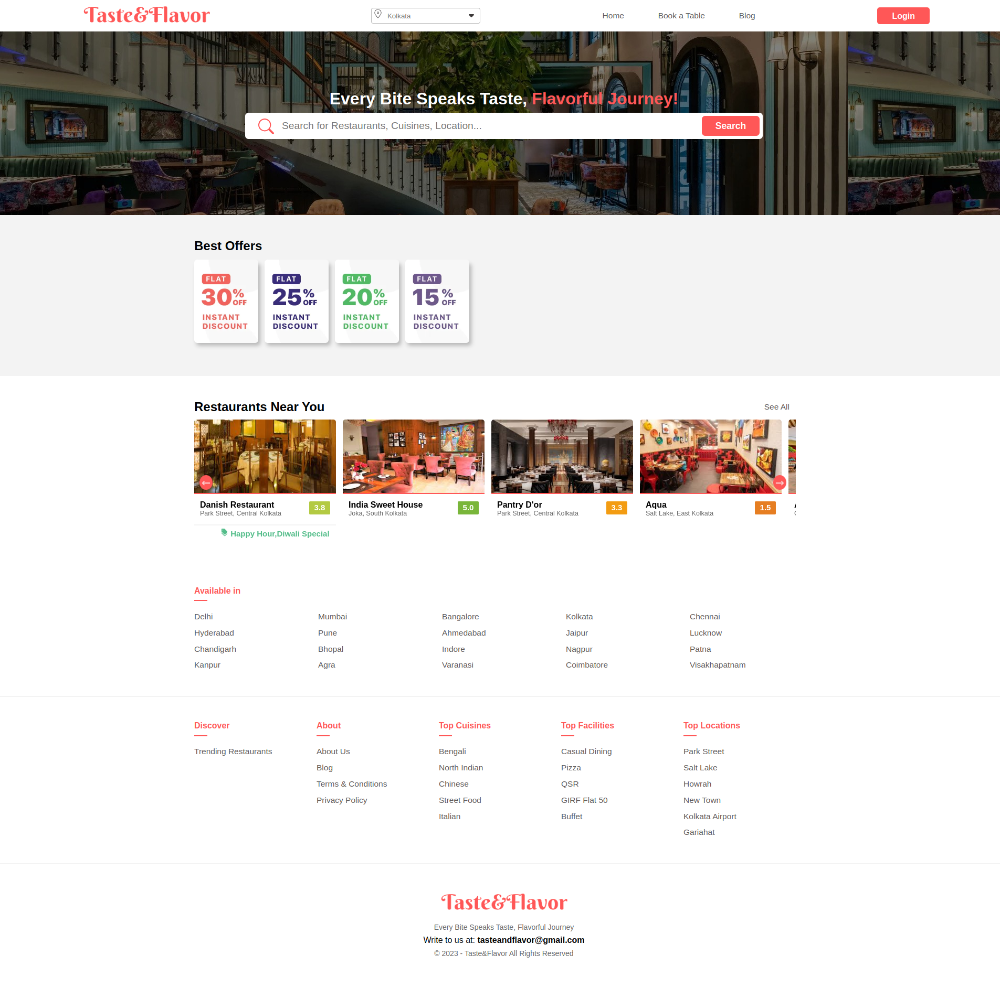
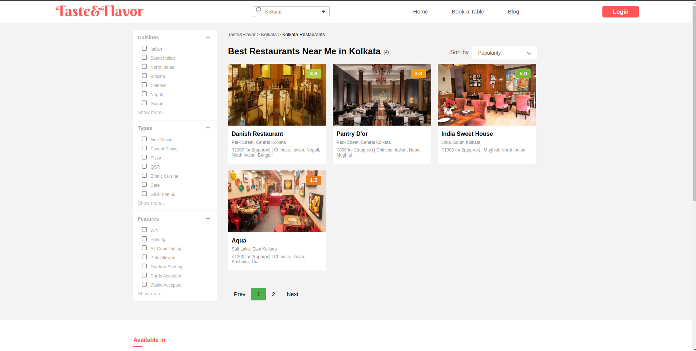
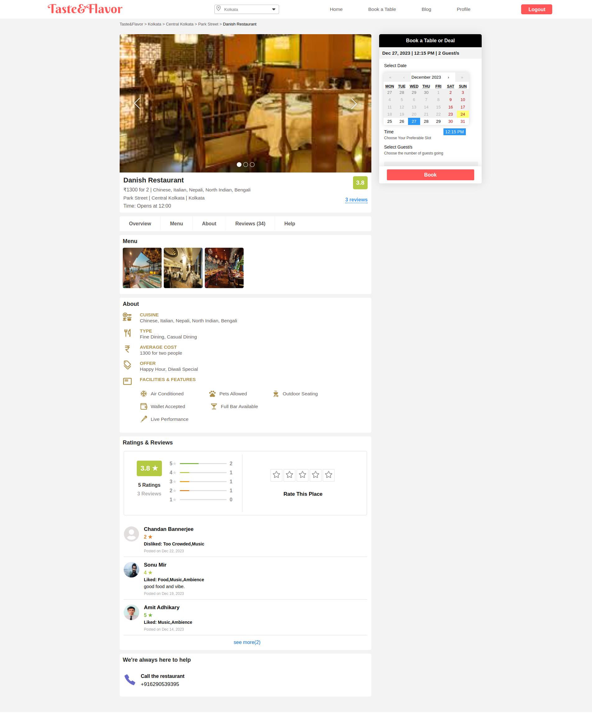
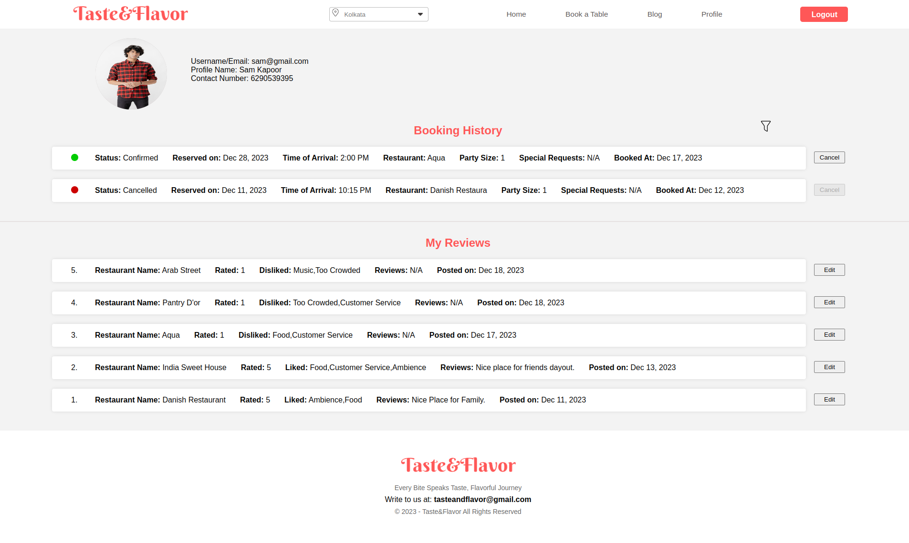
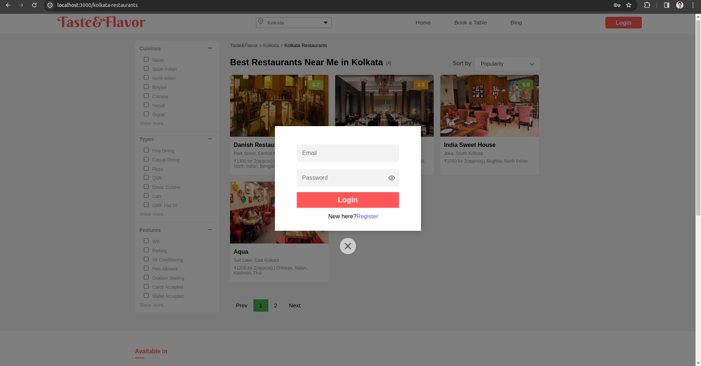
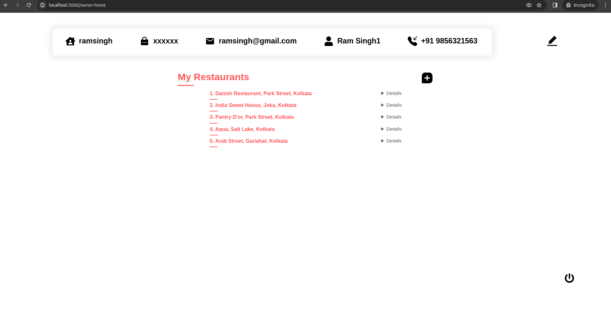
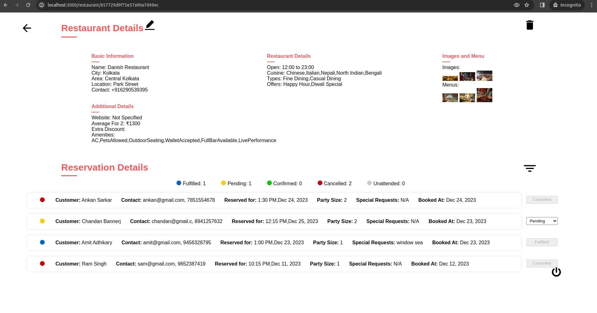
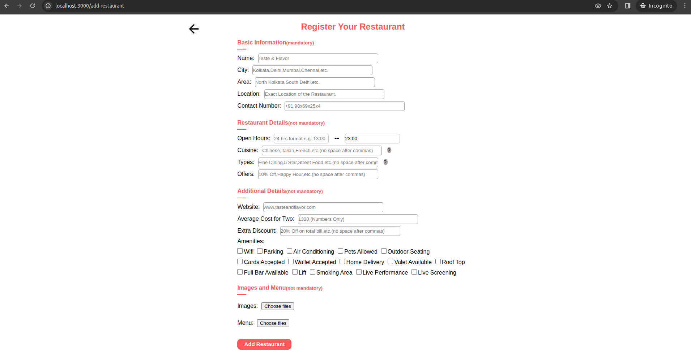

# Taste&Flavor

Taste&Flavor is a comprehensive restaurant management system that caters to both diners and restaurant owners. This platform facilitates a seamless dining experience by offering an array of features. Users can explore diverse restaurants, read authentic reviews, and effortlessly make reservations. Restaurant owners, on the other hand, benefit from streamlined management tools to enhance their business operations.

## Features

- **User-Friendly Interface:** Built with React.js and React Router for a seamless and responsive user experience.
- **Secure Authentication:** Firebase Authentication ensures a secure login process for users.
- **Backend Power:** Node.js and Express.js create a robust backend to handle server-side logic and API endpoints.
- **Data Storage:** MongoDB, along with Mongoose, provides efficient NoSQL database solutions for data storage and retrieval.
- **Additional Features:**
  - **Reviews:** Explore genuine user reviews for informed dining decisions.
  - **Booking System:** Streamlined reservation process for a hassle-free experience.
  - **Owner Dashboard:** Equipping restaurant owners with tools to manage bookings and reviews efficiently.
  - **Filtering Options:** Explore restaurants based on cuisine, type, and amenities.
  - **Firebase Cloud Functions:** Implementing serverless functions for additional backend functionalities.

## Tech Stack

- **Frontend:** React.js, React Router, Firebase Authentication.
- **Backend:** Node.js, Express.js, MongoDB, Mongoose.
- **Additional Tools:** Firebase Cloud Functions.

## Users Interfaces

- **For Customers:**

  - **Home Page:** Login/Signup with Firebase authentication and authorization | Footer is dynamic for all cities.
    
  - **Restaurant Listing Page:** Restaurants can be filtered and sorted in this page based on various parameters.
    
  - **Restaurant Details Page:** Reviews can be seen from latest to oldest order and given on clicking stars | Users can book slots as their prefered date and time | Booking and Giving reviews can only be done if user is logged in so the user will be authenticated in this process.
    
  - **Profile Page:** All Customer Details can be found in this page, to make it more attractive filter option has been added.
    

- **For Restaurant Owners:**

  - **Login/Registration Page:** Login/Signup with JW Token, whenever a user/owner logins a token is generated and the token is added to middleware for user authentication.
    
  - **Home Page:** All restaurant of an owner is listed in this page along with the owner details which can be updated | On clicking any restaurant details the restaurant details opens.
    
  - **Restaurant Details Page:** All the bookings details for that restaurant is present here | owner can change the status of the booking accordingly.
    
  - **Add Restaurant Page:** This is how a new restaurant can be added | Multiple images allowed.
    
